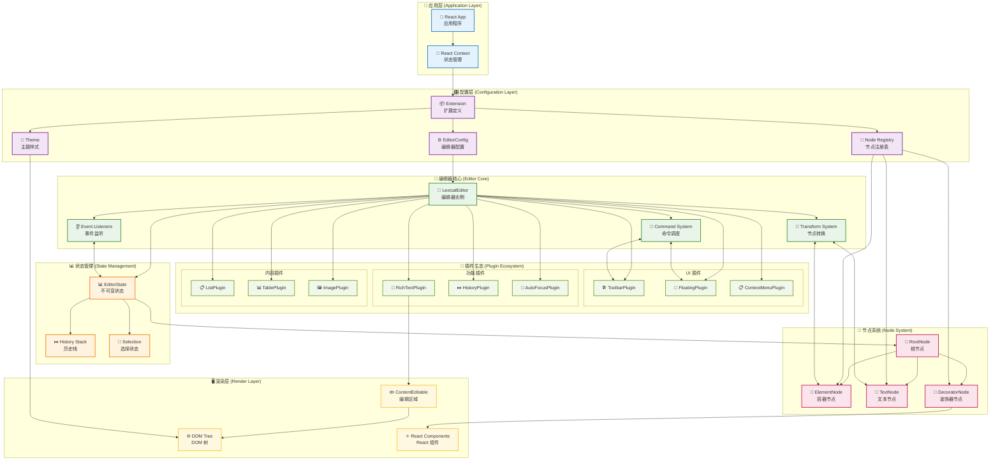
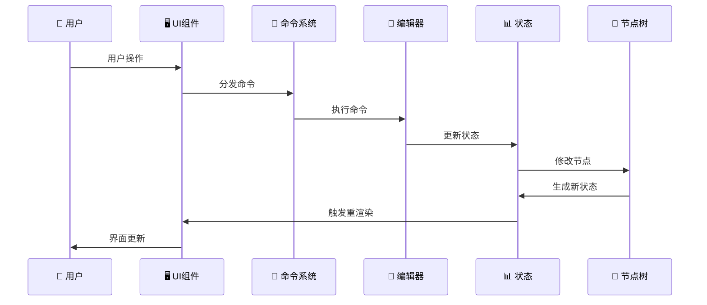

# Lexical 开发指南

基于 lexical-playground 的实战经验总结，提供完整的 Lexical 富文本编辑器开发指南。

## 目录

- [项目架构](#项目架构)
- [核心概念](#核心概念)
- [组件设计模式](#组件设计模式)
- [插件开发](#插件开发)
- [节点系统](#节点系统)
- [主题配置](#主题配置)
- [性能优化](#性能优化)
- [测试策略](#测试策略)
- [常见问题](#常见问题)

## 项目架构

### 1. 目录结构

基于 lexical-playground 的完整编辑器目录结构：

```
src/editor/
├── components/                    # 编辑器核心组件
│   ├── Editor.tsx                # 主编辑器组件 (RichTextPlugin/PlainTextPlugin)
│   ├── ContentEditable.tsx       # 可编辑内容区域
│   └── ErrorBoundary.tsx         # 错误边界组件
├── nodes/                        # 自定义节点定义
│   ├── AutocompleteNode.tsx      # 自动完成节点 (文本补全)
│   ├── EmojiNode.tsx             # 表情符号节点 (装饰器节点)
│   ├── EquationNode.tsx          # 数学公式节点 (KaTeX 渲染)
│   ├── ExcalidrawNode.tsx        # 绘图节点 (Excalidraw 集成)
│   ├── FigmaNode.tsx             # Figma 嵌入节点 (iframe 嵌入)
│   ├── ImageNode.tsx             # 图片节点 (支持调整大小、标题)
│   ├── KeywordNode.tsx           # 关键词高亮节点
│   ├── LayoutContainerNode.tsx   # 布局容器节点 (网格布局)
│   ├── LayoutItemNode.tsx        # 布局项节点
│   ├── MentionNode.tsx           # @提及节点
│   ├── PageBreakNode.tsx         # 分页符节点
│   ├── PollNode.tsx              # 投票/问卷节点
│   ├── SpecialTextNode.tsx       # 特殊文本节点 (高亮显示)
│   ├── StickyNode.tsx            # 便签节点 (可拖拽)
│   ├── TweetNode.tsx             # Twitter 嵌入节点
│   ├── YouTubeNode.tsx           # YouTube 视频节点
│   └── PlaygroundNodes.ts        # 节点注册表
├── plugins/                      # 功能插件
│   ├── ActionsPlugin.tsx         # 操作面板 (导入/导出/清空)
│   ├── AutocompletePlugin.tsx    # 自动完成插件
│   ├── AutoEmbedPlugin.tsx       # 自动嵌入插件 (URL 转换)
│   ├── AutoLinkPlugin.tsx        # 自动链接插件
│   ├── CodeActionMenuPlugin.tsx  # 代码块操作菜单
│   ├── CodeHighlightPlugin.tsx   # 代码高亮插件 (Prism.js)
│   ├── CollapsiblePlugin.tsx     # 折叠内容插件
│   ├── CommentPlugin.tsx         # 评论系统插件
│   ├── ComponentPickerPlugin.tsx # 组件选择器 (斜杠命令)
│   ├── ContextMenuPlugin.tsx     # 右键菜单插件
│   ├── DragDropPastePlugin.tsx   # 拖拽粘贴插件
│   ├── DraggableBlockPlugin.tsx  # 可拖拽块插件
│   ├── EmojiPickerPlugin.tsx     # 表情选择器插件
│   ├── EmojisPlugin.tsx          # 表情符号插件
│   ├── EquationsPlugin.tsx       # 数学公式插件
│   ├── ExcalidrawPlugin.tsx      # 绘图插件
│   ├── FigmaPlugin.tsx           # Figma 插件
│   ├── FloatingLinkEditorPlugin.tsx # 浮动链接编辑器
│   ├── FloatingTextFormatToolbarPlugin.tsx # 浮动格式工具栏
│   ├── ImagesPlugin.tsx          # 图片插件
│   ├── KeywordsPlugin.tsx        # 关键词插件
│   ├── LayoutPlugin.tsx          # 布局插件
│   ├── LinkPlugin.tsx            # 链接插件
│   ├── MarkdownShortcutPlugin.tsx # Markdown 快捷键
│   ├── MaxLengthPlugin.tsx       # 最大长度限制
│   ├── MentionsPlugin.tsx        # @提及插件
│   ├── PageBreakPlugin.tsx       # 分页符插件
│   ├── PollPlugin.tsx            # 投票插件
│   ├── ShortcutsPlugin.tsx       # 键盘快捷键
│   ├── SpecialTextPlugin.tsx     # 特殊文本插件
│   ├── SpeechToTextPlugin.tsx    # 语音转文字插件
│   ├── TabFocusPlugin.tsx        # Tab 焦点管理
│   ├── TableActionMenuPlugin.tsx # 表格操作菜单
│   ├── TableCellResizer.tsx      # 表格单元格调整
│   ├── TableHoverActionsPlugin.tsx # 表格悬停操作
│   ├── TableOfContentsPlugin.tsx # 目录插件
│   ├── ToolbarPlugin.tsx         # 主工具栏插件
│   ├── TreeViewPlugin.tsx        # 调试树视图
│   ├── TwitterPlugin.tsx         # Twitter 插件
│   ├── TypingPerfPlugin.tsx      # 输入性能监控
│   └── YouTubePlugin.tsx         # YouTube 插件
├── themes/                       # 主题样式
│   ├── PlaygroundEditorTheme.ts  # 主编辑器主题
│   ├── PlaygroundEditorTheme.css # 主题样式文件
│   ├── CommentEditorTheme.ts     # 评论编辑器主题
│   └── StickyEditorTheme.ts      # 便签编辑器主题
├── ui/                          # UI 组件库
│   ├── Button.tsx               # 按钮组件
│   ├── ColorPicker.tsx          # 颜色选择器
│   ├── ContentEditable.tsx      # 内容可编辑组件
│   ├── Dialog.tsx               # 对话框组件
│   ├── DropDown.tsx             # 下拉菜单组件
│   ├── DropdownColorPicker.tsx  # 下拉颜色选择器
│   ├── EquationEditor.tsx       # 公式编辑器
│   ├── ExcalidrawModal.tsx      # Excalidraw 模态框
│   ├── FileInput.tsx            # 文件输入组件
│   ├── FlashMessage.tsx         # 闪现消息组件
│   ├── ImageResizer.tsx         # 图片调整组件
│   ├── Input.tsx                # 输入框组件
│   ├── KatexEquationAlterer.tsx # KaTeX 公式编辑器
│   ├── KatexRenderer.tsx        # KaTeX 渲染器
│   ├── Modal.tsx                # 模态框组件
│   ├── Select.tsx               # 选择框组件
│   └── Switch.tsx               # 开关组件
├── utils/                       # 工具函数
│   ├── joinClasses.ts           # CSS 类名合并
│   ├── focusUtils.ts            # 焦点管理工具
│   └── exportUtils.ts           # 导出工具函数
├── context/                     # React Context
│   ├── FlashMessageContext.tsx  # 闪现消息上下文
│   ├── SettingsContext.tsx      # 设置上下文
│   ├── SharedHistoryContext.tsx # 共享历史上下文
│   └── ToolbarContext.tsx       # 工具栏上下文
├── hooks/                       # 自定义 Hooks
│   ├── useFlashMessage.tsx      # 闪现消息 Hook
│   ├── useModal.tsx             # 模态框 Hook
│   └── useReport.ts             # 报告 Hook
├── commenting/                  # 评论系统
│   └── index.ts                 # 评论存储和管理
└── server/                      # 服务端相关
    └── validation.ts            # 编辑器状态验证
```

### 2. 功能模块说明

#### 核心组件 (components/)

- **Editor.tsx**: 主编辑器组件，集成所有插件和功能
- **ContentEditable.tsx**: 可编辑内容区域的封装
- **ErrorBoundary.tsx**: 错误边界，处理编辑器异常

#### 节点系统 (nodes/)

- **装饰器节点**: ImageNode, EmojiNode, EquationNode 等可视化内容
- **嵌入节点**: YouTubeNode, TweetNode, FigmaNode 等第三方内容
- **交互节点**: PollNode, StickyNode 等可交互内容
- **布局节点**: LayoutContainerNode, LayoutItemNode 等布局控制

#### 插件系统 (plugins/)

- **输入增强**: AutocompletePlugin, EmojiPickerPlugin, MentionsPlugin
- **格式化**: ToolbarPlugin, FloatingTextFormatToolbarPlugin
- **内容处理**: DragDropPastePlugin, MarkdownShortcutPlugin
- **交互功能**: ContextMenuPlugin, ComponentPickerPlugin
- **专业功能**: CodeHighlightPlugin, EquationsPlugin, TablePlugin

#### UI 组件 (ui/)

- **基础组件**: Button, Input, Modal, Dialog
- **专业组件**: ColorPicker, ImageResizer, KatexRenderer
- **编辑器组件**: ContentEditable, EquationEditor

#### 主题系统 (themes/)

- **主题定义**: 样式类名映射和 CSS 变量
- **多主题支持**: 主编辑器、评论、便签等不同场景主题

### 3. Extension 架构（推荐）

基于 lexical-playground 的 Extension 架构模式：

```typescript
import { defineExtension } from 'lexical'
import { RichTextExtension } from '@lexical/rich-text'
import { HistoryExtension } from '@lexical/history'

const appExtension = defineExtension({
  name: 'MyEditor',
  namespace: 'MyEditor',
  dependencies: [
    RichTextExtension,
    HistoryExtension,
  ],
  theme: MyTheme,
  $initialEditorState: $prepopulatedContent,
})
```

### 区别

#### Extension vs Plugin 对比

以历史记录功能为例，展示两种架构的区别：

```typescript
// Extension 方式 - 配置层
import { HistoryExtension } from '@lexical/history'

const MyExtension = defineExtension({
  name: 'MyEditor',
  dependencies: [
    RichTextExtension,
    HistoryExtension,  // 声明依赖历史功能
  ],
  // 配置会自动合并，无需手动管理
})

// Plugin 方式 - 功能层
import { HistoryPlugin } from '@lexical/react/LexicalHistoryPlugin'

function MyEditor() {
  return (
    <LexicalExtensionComposer extension={MyExtension}>
      <RichTextPlugin />
      <HistoryPlugin />  {/* 手动添加历史功能 */}
      <ToolbarPlugin />
    </LexicalExtensionComposer>
  )
}
```

#### Extension（扩展）特点

- **配置管理**: 统一管理节点、主题、HTML 配置
- **依赖声明**: 声明需要的功能扩展，自动解析依赖关系
- **状态初始化**: 设置初始编辑器状态
- **命名空间**: 提供唯一标识
- **自动合并**: 配置项自动合并，避免冲突

#### Plugin（插件）特点

- **功能实现**: 具体的编辑器功能逻辑
- **事件处理**: 监听和响应编辑器事件
- **UI 渲染**: 提供用户界面组件
- **状态管理**: 管理特定功能的状态
- **手动管理**: 需要手动添加和配置

#### 使用场景对比

**Extension 适用于**:

- 基础功能配置（历史记录、富文本、表格等）
- 依赖管理复杂的场景
- 需要统一配置的项目
- 可复用的编辑器配置

**Plugin 适用于**:

- 具体的 UI 组件（工具栏、浮动菜单等）
- 特定的交互功能（拖拽、右键菜单等）
- 需要动态控制的功能
- 自定义的业务逻辑

#### 协作关系

- **Extension 提供基础**: 配置编辑器的基本能力和环境
- **Plugin 实现功能**: 在 Extension 提供的环境中实现具体功能
- **Extension 不替代 Plugin**: 两者互补，Extension 负责配置，Plugin 负责功能
- **Plugin 可以独立存在**: 在 Extension 架构中，Plugin 仍然是功能的主要载体

Extension 是配置和依赖管理的抽象层，Plugin 是功能实现的执行层，两者共同构成了 Lexical 的完整架构。

## 核心概念

### Lexical 核心架构图



### 架构层次说明

#### 1. 配置层（Configuration Layer）

- **Extension**: 声明式配置，管理依赖和主题
- **EditorConfig**: 编辑器初始化配置
- **Theme**: 样式主题配置

#### 2. 编辑器层（Editor Layer）

- **LexicalEditor**: 编辑器核心实例，协调所有组件
- **Command System**: 事件驱动的命令系统

#### 3. 状态层（State Layer）

- **EditorState**: 不可变的编辑器状态快照
- **Node Tree**: 文档内容的树状结构
- **Selection**: 用户选择和光标状态

#### 4. 节点层（Node Layer）

- **ElementNode**: 容器节点（段落、标题、列表）
- **TextNode**: 文本内容节点
- **DecoratorNode**: 复杂组件节点（图片、视频）

#### 5. 插件层（Plugin Layer）

- **UI Plugin**: 提供用户界面组件
- **Function Plugin**: 实现具体功能逻辑
- **Transform Plugin**: 处理内容转换

#### 6. 界面层（UI Layer）

- **Toolbar**: 格式化工具栏
- **ContentEditable**: 可编辑内容区域
- **Floating UI**: 浮动菜单和工具

### 数据流向



### 1. EditorState（编辑器状态）

**概念**: EditorState 是 Lexical 的核心数据结构，表示编辑器在某个时刻的完整状态

**特性**:

- **不可变性**: 每次更新都会创建新的 EditorState
- **序列化**: 可以序列化为 JSON 进行存储和传输
- **时间旅行**: 支持撤销/重做功能
- **快照**: 可以保存和恢复编辑器状态

```typescript
// 读取状态（只读操作）
editorState.read(() => {
  const root = $getRoot()
  const textContent = root.getTextContent()
})

// 更新状态（写操作）
editor.update(() => {
  const root = $getRoot()
  const paragraph = $createParagraphNode()
  root.append(paragraph)
})

// 监听状态变化
editor.registerUpdateListener(({ editorState, prevEditorState }) => {
  // 状态变化时的处理逻辑
})
```

### 2. Node（节点系统）

**概念**: Node 是编辑器内容的基本构建块，形成树状结构

**节点类型**:

- **ElementNode**: 容器节点（段落、标题、列表等）
- **TextNode**: 文本节点（包含格式信息）
- **DecoratorNode**: 装饰器节点（图片、视频等复杂组件）
- **LineBreakNode**: 换行节点

```typescript
// 节点层次结构
class CustomElementNode extends ElementNode {
  static getType() { return 'custom-element' }
  
  createDOM(config) {
    return document.createElement('div')
  }
  
  canBeEmpty() { return false }
  canInsertTextBefore() { return true }
}

// 装饰器节点（渲染 React 组件）
class CustomDecoratorNode extends DecoratorNode {
  static getType() { return 'custom-decorator' }
  
  decorate() {
    return <CustomComponent data={this.__data} />
  }
}

// 节点创建和操作
const paragraph = $createParagraphNode()
const text = $createTextNode('Hello')
text.setFormat('bold')
paragraph.append(text)
```

### 3. Selection（选择系统）

**概念**: Selection 表示用户在编辑器中的选择状态

**选择类型**:

- **RangeSelection**: 文本范围选择
- **NodeSelection**: 节点选择（如图片）
- **GridSelection**: 表格单元格选择

```typescript
// 获取和操作选择
const selection = $getSelection()

if ($isRangeSelection(selection)) {
  // 文本选择操作
  selection.formatText('bold')
  const selectedText = selection.getTextContent()
}

if ($isNodeSelection(selection)) {
  // 节点选择操作
  const selectedNodes = selection.getNodes()
}

// 设置选择
const newSelection = $createRangeSelection()
newSelection.anchor.set(nodeKey, offset, 'text')
newSelection.focus.set(nodeKey, offset, 'text')
$setSelection(newSelection)
```

### 4. Command（命令系统）

**概念**: Command 是 Lexical 的事件系统，用于处理用户交互和编辑器操作

**命令特性**:

- **优先级**: 命令有执行优先级
- **传播**: 命令可以被拦截和阻止传播
- **类型安全**: 支持 TypeScript 类型检查

```typescript
// 定义命令
const MY_CUSTOM_COMMAND = createCommand<PayloadType>()

// 注册命令处理器
editor.registerCommand(
  MY_CUSTOM_COMMAND,
  (payload) => {
    // 处理命令逻辑
    return true // 阻止命令继续传播
  },
  COMMAND_PRIORITY_HIGH
)

// 分发命令
editor.dispatchCommand(MY_CUSTOM_COMMAND, payload)

// 内置命令示例
editor.dispatchCommand(FORMAT_TEXT_COMMAND, 'bold')
editor.dispatchCommand(INSERT_PARAGRAPH_COMMAND, undefined)
```

### 5. Plugin（插件系统）

**概念**: Plugin 是扩展编辑器功能的模块化组件

**插件类型**:

- **功能插件**: 添加新功能（如自动保存）
- **UI 插件**: 提供用户界面（如工具栏）
- **转换插件**: 处理内容转换（如 Markdown）
- **监听插件**: 响应编辑器事件

```typescript
// 基础插件结构
function MyPlugin({ config }) {
  const [editor] = useLexicalComposerContext()
  
  useEffect(() => {
    // 注册命令、监听器、转换器等
    return mergeRegister(
      editor.registerCommand(COMMAND, handler, priority),
      editor.registerUpdateListener(updateHandler),
      editor.registerNodeTransform(NodeType, transformer)
    )
  }, [editor])
  
  return null // 或返回 UI 组件
}

// 插件组合
function Editor() {
  return (
    <LexicalComposer initialConfig={config}>
      <RichTextPlugin />
      <HistoryPlugin />
      <MyCustomPlugin />
      <ToolbarPlugin />
    </LexicalComposer>
  )
}
```

### 6. Extension

**概念**: Extension 是新的模块化架构，提供更好的组合性和依赖管理

**扩展特性**:

- **依赖管理**: 自动解析扩展依赖
- **配置合并**: 自动合并主题、节点等配置
- **生命周期**: 统一的初始化和清理

```typescript
// 定义扩展
const MyExtension = defineExtension({
  name: 'MyExtension',
  dependencies: [RichTextExtension, HistoryExtension],
  nodes: [CustomNode],
  theme: customTheme,
  
  onInitialize(editor) {
    // 扩展初始化逻辑
  },
  
  onDestroy(editor) {
    // 扩展清理逻辑
  }
})

// 组合扩展
const AppExtension = defineExtension({
  name: 'App',
  dependencies: [
    MyExtension,
    TableExtension,
    LinkExtension
  ]
})

// 使用扩展
<LexicalExtensionComposer extension={AppExtension}>
  <ContentEditable />
</LexicalExtensionComposer>
```

### 7. Transform（转换系统）

**概念**: Transform 用于在节点创建或更新时自动应用转换规则

**转换类型**:

- **节点转换**: 修改或替换节点
- **文本转换**: 处理文本输入
- **元素转换**: 调整元素结构

```typescript
// 节点转换示例
editor.registerNodeTransform(TextNode, (textNode) => {
  const text = textNode.getTextContent()
  
  // 自动链接转换
  if (isURL(text)) {
    const linkNode = $createLinkNode(text)
    linkNode.append($createTextNode(text))
    textNode.replace(linkNode)
  }
})

// 元素转换示例
editor.registerNodeTransform(ParagraphNode, (paragraphNode) => {
  // 确保段落不为空
  if (paragraphNode.getChildrenSize() === 0) {
    paragraphNode.append($createTextNode(''))
  }
})
```

### 8. 组合模式

**编辑器组合的层次结构**:

```typescript
// 1. 基础层：Extension 定义
const CoreExtension = defineExtension({
  dependencies: [RichTextExtension, HistoryExtension]
})

// 2. 功能层：添加具体功能
const FeatureExtension = defineExtension({
  dependencies: [CoreExtension, TableExtension, LinkExtension]
})

// 3. 应用层：完整编辑器
const AppExtension = defineExtension({
  dependencies: [FeatureExtension],
  $initialEditorState: initialContent
})

// 4. UI 层：用户界面
function MyEditor() {
  return (
    <LexicalExtensionComposer extension={AppExtension}>
      <ToolbarPlugin />      {/* UI 插件 */}
      <ContentEditable />    {/* 编辑区域 */}
      <AutoSavePlugin />     {/* 功能插件 */}
      <TreeViewPlugin />     {/* 调试插件 */}
    </LexicalExtensionComposer>
  )
}
```

### 9. 数据流

**Lexical 的数据流模式**:

```typescript
// 用户输入 → 命令 → 状态更新 → UI 重渲染

// 1. 用户操作触发命令
user.click() → dispatchCommand(FORMAT_TEXT_COMMAND, 'bold')

// 2. 命令处理器更新状态
commandHandler() → editor.update(() => {
  selection.formatText('bold')
})

// 3. 状态变化触发监听器
editorState.change → updateListener(({ editorState }) => {
  // 更新 UI 状态
})

// 4. UI 重新渲染
React.rerender() → <ToolbarButton active={isBold} />
```

## 组件设计模式

### 1. 装饰器节点组件

```typescript
// ImageComponent.tsx
export default function ImageComponent({
  src,
  altText,
  nodeKey,
  width,
  height,
}: ImageComponentProps) {
  const [editor] = useLexicalComposerContext()
  const [isSelected, setSelected] = useLexicalNodeSelection(nodeKey)
  
  return (
    <Suspense fallback={<ImageSkeleton />}>
       setSelected(!isSelected)}
      />
    </Suspense>
  )
}
```

### 2. 嵌套编辑器

```typescript
// 用于图片标题、表格单元格等场景
function NestedEditor({ initialEditor }: { initialEditor: LexicalEditor }) {
  return (
    <LexicalNestedComposer initialEditor={initialEditor}>
      <RichTextPlugin
        contentEditable={<ContentEditable />}
        ErrorBoundary={LexicalErrorBoundary}
      />
      <HistoryPlugin />
    </LexicalNestedComposer>
  )
}
```

### 3. 上下文管理

```typescript
// ToolbarContext.tsx
export const ToolbarContext = createContext<ToolbarContextType>()

export function useToolbarState() {
  const context = useContext(ToolbarContext)
  if (!context) {
    throw new Error('useToolbarState must be used within ToolbarProvider')
  }
  return context
}
```

## 插件开发

### 1. 基础插件结构

```typescript
// MyPlugin.tsx
export default function MyPlugin(): null {
  const [editor] = useLexicalComposerContext()
  
  useEffect(() => {
    return mergeRegister(
      editor.registerCommand(
        MY_COMMAND,
        (payload) => {
          // 处理命令
          return true
        },
        COMMAND_PRIORITY_LOW
      ),
      
      editor.registerNodeTransform(MyNode, (node) => {
        // 节点转换逻辑
      })
    )
  }, [editor])
  
  return null
}
```

### 2. 工具栏插件

```typescript
// ToolbarPlugin.tsx
export default function ToolbarPlugin() {
  const [editor] = useLexicalComposerContext()
  const [blockType, setBlockType] = useState('paragraph')
  const [isBold, setIsBold] = useState(false)
  
  const updateToolbar = useCallback(() => {
    const selection = $getSelection()
    if ($isRangeSelection(selection)) {
      setIsBold(selection.hasFormat('bold'))
      // 更新其他状态...
    }
  }, [])
  
  useEffect(() => {
    return editor.registerUpdateListener(({ editorState }) => {
      editorState.read(() => {
        updateToolbar()
      })
    })
  }, [editor, updateToolbar])
  
  return (
    <div className="toolbar">
      <button
        className={isBold ? 'active' : ''}
        onClick={() => {
          editor.dispatchCommand(FORMAT_TEXT_COMMAND, 'bold')
        }}
      >
        Bold
      </button>
    </div>
  )
}
```

### 3. 自动保存插件

```typescript
// AutoSavePlugin.tsx
export default function AutoSavePlugin({ 
  onSave 
}: { 
  onSave: (content: string) => void 
}) {
  const [editor] = useLexicalComposerContext()
  
  useEffect(() => {
    let timeoutId: NodeJS.Timeout
    
    const handleUpdate = () => {
      clearTimeout(timeoutId)
      timeoutId = setTimeout(() => {
        editor.getEditorState().read(() => {
          const content = $generateHtmlFromNodes(editor)
          onSave(content)
        })
      }, 1000)
    }
    
    return editor.registerUpdateListener(handleUpdate)
  }, [editor, onSave])
  
  return null
}
```

## 节点系统

### 1. 自定义节点

```typescript
// CustomNode.ts
export class CustomNode extends DecoratorNode<JSX.Element> {
  __data: CustomNodeData
  
  static getType(): string {
    return 'custom'
  }
  
  static clone(node: CustomNode): CustomNode {
    return new CustomNode(node.__data, node.__key)
  }
  
  constructor(data: CustomNodeData, key?: NodeKey) {
    super(key)
    this.__data = data
  }
  
  createDOM(config: EditorConfig): HTMLElement {
    const element = document.createElement('div')
    element.className = config.theme.custom || 'custom-node'
    return element
  }
  
  updateDOM(): false {
    return false
  }
  
  decorate(): JSX.Element {
    return <CustomComponent data={this.__data} nodeKey={this.__key} />
  }
  
  static importJSON(serializedNode: SerializedCustomNode): CustomNode {
    return $createCustomNode(serializedNode.data)
  }
  
  exportJSON(): SerializedCustomNode {
    return {
      ...super.exportJSON(),
      data: this.__data,
    }
  }
}

export function $createCustomNode(data: CustomNodeData): CustomNode {
  return $applyNodeReplacement(new CustomNode(data))
}

export function $isCustomNode(node: LexicalNode): node is CustomNode {
  return node instanceof CustomNode
}
```

### 2. 节点转换

```typescript
// 自动转换 URL 为链接
editor.registerNodeTransform(TextNode, (textNode) => {
  const text = textNode.getTextContent()
  const urlRegex = /https?:\/\/[^\s]+/g
  
  if (urlRegex.test(text)) {
    const linkNode = $createLinkNode(text)
    linkNode.append($createTextNode(text))
    textNode.replace(linkNode)
  }
})
```

### 3. 节点验证

```typescript
// 确保列表项只能包含在列表中
editor.registerNodeTransform(ListItemNode, (listItemNode) => {
  const parent = listItemNode.getParent()
  if (!$isListNode(parent)) {
    const list = $createListNode('bullet')
    listItemNode.insertBefore(list)
    list.append(listItemNode)
  }
})
```

## 主题配置

### 1. 主题结构

```typescript
// PlaygroundEditorTheme.ts
const theme: EditorThemeClasses = {
  // 文本样式
  text: {
    bold: 'editor-text-bold',
    italic: 'editor-text-italic',
    underline: 'editor-text-underline',
    strikethrough: 'editor-text-strikethrough',
    code: 'editor-text-code',
  },
  
  // 段落样式
  paragraph: 'editor-paragraph',
  
  // 标题样式
  heading: {
    h1: 'editor-heading-h1',
    h2: 'editor-heading-h2',
    h3: 'editor-heading-h3',
  },
  
  // 列表样式
  list: {
    nested: {
      listitem: 'editor-nested-listitem',
    },
    ol: 'editor-list-ol',
    ul: 'editor-list-ul',
    listitem: 'editor-listitem',
    listitemChecked: 'editor-listitem-checked',
    listitemUnchecked: 'editor-listitem-unchecked',
  },
  link: 'editor-link',
  code: 'editor-code',
  codeHighlight: { /* 代码高亮样式映射 */ },
}
```

### 2. CSS 样式配置

通过 CSS 类名定义编辑器样式：

- 文本格式：`.editor-text-bold`、`.editor-text-italic`
- 标题样式：`.editor-heading-h1` 到 `.editor-heading-h6`
- 列表样式：`.editor-list-ol`、`.editor-list-ul`
- 链接样式：`.editor-link`
- 代码样式：`.editor-code`

## 性能优化

### 1. 懒加载组件

- 使用 `React.lazy` 延迟加载大型组件
- 在节点装饰器中使用 `Suspense` 包装
- 适用于图片、图表等重型组件

### 2. 防抖更新

- 使用 `debounce` 避免频繁的状态更新
- 在 `registerUpdateListener` 中应用防抖
- 推荐延迟 300ms

### 3. 选择性渲染

- 使用 `React.memo` 包装工具栏组件
- 实现浅比较避免不必要的重渲染
- 只在状态真正改变时更新 UI

### 4. 虚拟化长列表

- 使用 `react-window` 处理大量节点
- 适用于长文档或大量列表项
- 只渲染可见区域的内容

## 测试策略

### 1. 单元测试

- 测试自定义节点的创建和数据处理
- 验证序列化/反序列化功能
- 测试工具函数和转换逻辑
- 使用 Jest 和 @testing-library

### 2. 集成测试

- 测试编辑器组件交互
- 验证插件功能集成
- 测试格式化命令执行
- 模拟用户操作流程

### 3. E2E 测试

- 使用 Playwright 测试完整用户流程
- 验证跨浏览器兼容性
- 测试自动保存和数据持久化
- 检查性能和加载时间

## 常见问题

### 1. 状态同步问题

**问题**: 编辑器状态与 React 状态不同步  
**解决**: 使用 `registerUpdateListener` 监听状态变化，在回调中更新 React 状态

### 2. 焦点管理

**问题**: 编辑器失去焦点后难以重新获得焦点  
**解决**: 使用 `AutoFocusPlugin` 或调用 `editor.focus()` 方法

### 3. 序列化问题

**问题**: 自定义节点序列化/反序列化失败  
**解决**: 正确实现 `importJSON` 和 `exportJSON` 方法，确保包含 `type` 字段

### 4. 内存泄漏

**问题**: 插件或监听器导致内存泄漏  
**解决**: 在 `useEffect` 清理函数中取消注册所有监听器，使用 `mergeRegister` 简化管理

### 5. 协作编辑冲突

**问题**: 多用户编辑时出现冲突  
**解决**: 使用 `CollaborationPlugin` 配合 Y.js 和 WebSocket 提供商

## 总结

Lexical 提供了强大而灵活的富文本编辑能力，通过合理的架构设计、插件开发和性能优化，可以构建出高质量的编辑器应用。关键要点：

1. **使用 Extension 架构** - 更好的组合性和可维护性
2. **合理设计节点系统** - 清晰的数据模型和转换逻辑  
3. **注重性能优化** - 懒加载、防抖、虚拟化等技术
4. **完善的测试覆盖** - 单元测试、集成测试、E2E 测试
5. **处理常见问题** - 状态同步、焦点管理、内存泄漏等

遵循这些最佳实践，可以帮助开发者构建出稳定、高性能的 Lexical 编辑器应用。

## Lexical Playground 架构解析

### 1. 协作编辑器完整架构

```typescript
// 完整的协作编辑器架构层次
<LexicalCollaboration>
  <LexicalExtensionComposer extension={app} contentEditable={null}>
    <SharedHistoryContext>
      <TableContext>
        <ToolbarContext>
          <header>
            <a href="https://lexical.dev" target="_blank" rel="noreferrer">
              
            </a>
          </header>
          <div className="editor-shell">
            <Editor />
          </div>
          <Settings />
          {isDevPlayground ? <DocsPlugin /> : null}
          {isDevPlayground ? <PasteLogPlugin /> : null}
          {isDevPlayground ? <TestRecorderPlugin /> : null}
          {measureTypingPerf ? <TypingPerfPlugin /> : null}
        </ToolbarContext>
      </TableContext>
    </SharedHistoryContext>
  </LexicalExtensionComposer>
</LexicalCollaboration>
```

**架构层次说明**:

1. **LexicalCollaboration**: 协作编辑的根上下文
   - 管理多用户协作状态
   - 提供用户信息和连接状态
   - 处理协作冲突解决

2. **LexicalExtensionComposer**: 新架构的编辑器容器
   - 使用 Extension 系统替代传统 Plugin 模式
   - 自动管理依赖和配置合并
   - 提供更好的类型安全和组合性

3. **SharedHistoryContext**: 共享历史记录上下文
   - 在协作模式下同步撤销/重做操作
   - 管理历史记录状态
   - 防止历史记录冲突

4. **TableContext**: 表格功能上下文
   - 管理表格选择状态
   - 提供表格操作 API
   - 处理表格相关的用户交互

5. **ToolbarContext**: 工具栏状态上下文
   - 管理工具栏按钮状态
   - 提供格式化操作接口
   - 同步编辑器状态到 UI

### 2. Editor 组件主要结构

```typescript
export default function Editor(): JSX.Element {
  // === 上下文和状态管理 ===
  const {historyState} = useSharedHistoryContext()  // 共享历史状态
  const {settings} = useSettings()                   // 编辑器设置
  const isEditable = useLexicalEditable()           // 编辑状态
  const [editor] = useLexicalComposerContext()      // 编辑器实例
  const [activeEditor, setActiveEditor] = useState(editor)  // 当前活跃编辑器
  
  // === UI 状态管理 ===
  const [floatingAnchorElem, setFloatingAnchorElem] = useState<HTMLDivElement | null>(null)
  const [isSmallWidthViewport, setIsSmallWidthViewport] = useState<boolean>(false)
  const [isLinkEditMode, setIsLinkEditMode] = useState<boolean>(false)
  
  return (
    <>
      {/* === 工具栏层 === */}
      {isRichText && (
        <ToolbarPlugin
          editor={editor}                    // 编辑器实例
          activeEditor={activeEditor}        // 当前活跃编辑器
          setActiveEditor={setActiveEditor}  // 切换编辑器（嵌套编辑器场景）
          setIsLinkEditMode={setIsLinkEditMode}  // 链接编辑模式
        />
      )}
      
      {/* === 快捷键层 === */}
      {isRichText && (
        <ShortcutsPlugin
          editor={activeEditor}
          setIsLinkEditMode={setIsLinkEditMode}
        />
      )}
      
      {/* === 编辑器容器 === */}
      <div className={`editor-container ${showTreeView ? 'tree-view' : ''} ${
        !isRichText ? 'plain-text' : ''
      }`}>
        
        {/* === 核心功能插件层 === */}
        {isMaxLength && <MaxLengthPlugin maxLength={30} />}  {/* 字符限制 */}
        <DragDropPaste />                                    {/* 拖拽粘贴 */}
        <AutoFocusPlugin />                                  {/* 自动聚焦 */}
        {selectionAlwaysOnDisplay && <SelectionAlwaysOnDisplay />}  {/* 选择显示 */}
        <ClearEditorPlugin />                                {/* 清空编辑器 */}
        
        {/* === 输入增强插件层 === */}
        <ComponentPickerPlugin />  {/* 组件选择器（/ 命令） */}
        <EmojiPickerPlugin />      {/* 表情选择器 */}
        <AutoEmbedPlugin />        {/* 自动嵌入（链接转换） */}
        <MentionsPlugin />         {/* @提及功能 */}
        <EmojisPlugin />           {/* 表情转换 */}
        <HashtagPlugin />          {/* #标签功能 */}
        <KeywordsPlugin />         {/* 关键词高亮 */}
        <SpeechToTextPlugin />     {/* 语音输入 */}
        <AutoLinkPlugin />         {/* 自动链接 */}
        <DateTimePlugin />         {/* 日期时间 */}
        
        {/* === 协作和历史管理 === */}
        {!(isCollab && useCollabV2) && (
          <CommentPlugin  {/* 评论功能（非协作 V2 模式） */}
            providerFactory={isCollab ? createWebsocketProvider : undefined}
          />
        )}
        
        {/* === 核心编辑插件 === */}
        {isRichText ? (
          <>
            {/* 协作或历史管理 */}
            {isCollab ? (
              useCollabV2 ? (
                <>
                  <CollabV2  {/* 协作 V2（实验性） */}
                    id={COLLAB_DOC_ID}
                    shouldBootstrap={!skipCollaborationInit}
                  />
                  <VersionsPlugin id={COLLAB_DOC_ID} />  {/* 版本管理 */}
                </>
              ) : (
                <CollaborationPlugin  {/* 标准协作插件 */}
                  id={COLLAB_DOC_ID}
                  providerFactory={createWebsocketProvider}
                  shouldBootstrap={!skipCollaborationInit}
                />
              )
            ) : (
              <HistoryPlugin externalHistoryState={historyState} />  {/* 本地历史 */}
            )}
            
            {/* 富文本核心插件 */}
            <RichTextPlugin
              contentEditable={
                <div className="editor-scroller">
                  <div className="editor" ref={onRef}>
                    <ContentEditable placeholder={placeholder} />
                  </div>
                </div>
              }
              ErrorBoundary={LexicalErrorBoundary}
            />
            
            {/* === 富文本功能插件层 === */}
            <MarkdownShortcutPlugin />  {/* Markdown 快捷键 */}
            
            {/* 代码高亮 */}
            {isCodeHighlighted && (
              isCodeShiki ? (
                <CodeHighlightShikiPlugin />  {/* Shiki 高亮引擎 */}
              ) : (
                <CodeHighlightPrismPlugin />  {/* Prism 高亮引擎 */}
              )
            )}
            
            {/* 列表功能 */}
            <ListPlugin />                    {/* 基础列表 */}
            <CheckListPlugin />               {/* 复选框列表 */}
            <TabIndentationPlugin />          {/* Tab 缩进 */}
            
            {/* 表格功能 */}
            <TablePlugin
              hasCellMerge={tableCellMerge}                      {/* 单元格合并 */}
              hasCellBackgroundColor={tableCellBackgroundColor}  {/* 背景色 */}
              hasHorizontalScroll={tableHorizontalScroll}       {/* 水平滚动 */}
            />
            <TableCellResizer />              {/* 表格调整器 */}
            <TableCellActionMenuPlugin        {/* 表格操作菜单 */}
              anchorElem={floatingAnchorElem}
              cellMerge={tableCellMerge}
            />
            <TableHoverActionsPlugin />       {/* 表格悬停操作 */}
            
            {/* 媒体和嵌入 */}
            <ImagesPlugin />                  {/* 图片插件 */}
            <YouTubePlugin />                 {/* YouTube 嵌入 */}
            <TwitterPlugin />                 {/* Twitter 嵌入 */}
            <FigmaPlugin />                   {/* Figma 嵌入 */}
            <ExcalidrawPlugin />              {/* Excalidraw 绘图 */}
            
            {/* 特殊内容 */}
            <EquationsPlugin />               {/* 数学公式 */}
            <PollPlugin />                    {/* 投票组件 */}
            <PageBreakPlugin />               {/* 分页符 */}
            <HorizontalRulePlugin />          {/* 水平分割线 */}
            <CollapsiblePlugin />             {/* 折叠内容 */}
            <LayoutPlugin />                  {/* 布局组件 */}
            
            {/* 交互增强 */}
            <ClickableLinkPlugin />           {/* 可点击链接 */}
            <LinkPlugin />                    {/* 链接管理 */}
            <FloatingLinkEditorPlugin         {/* 浮动链接编辑器 */}
              anchorElem={floatingAnchorElem}
              isLinkEditMode={isLinkEditMode}
              setIsLinkEditMode={setIsLinkEditMode}
            />
            
            {/* 浮动工具栏 */}
            <FloatingTextFormatToolbarPlugin
              anchorElem={floatingAnchorElem}
              setIsLinkEditMode={setIsLinkEditMode}
            />
            
            {/* 拖拽和上下文菜单 */}
            <DraggableBlockPlugin anchorElem={floatingAnchorElem} />
            {shouldUseLexicalContextMenu && (
              <ContextMenuPlugin anchorElem={floatingAnchorElem} />
            )}
            
            {/* 字符限制 */}
            {isCharLimit && (
              <CharacterLimitPlugin
                charset={isCharLimitUtf8 ? 'UTF-8' : 'UTF-16'}
                maxLength={5}
              />
            )}
            
            {/* 自动完成 */}
            {isAutocomplete && <AutocompletePlugin />}
            
            {/* 特殊文本处理 */}
            <SpecialTextPlugin />
            
            {/* 代码操作菜单 */}
            {isCodeHighlighted && (
              <CodeActionMenuPlugin anchorElem={floatingAnchorElem} />
            )}
            
          </>
        ) : (
          {/* === 纯文本模式 === */}
          <>
            <PlainTextPlugin
              contentEditable={<ContentEditable placeholder={placeholder} />}
              ErrorBoundary={LexicalErrorBoundary}
            />
            <HistoryPlugin externalHistoryState={historyState} />
          </>
        )}
        
        {/* === 辅助功能插件层 === */}
        <TabFocusPlugin />                    {/* Tab 焦点管理 */}
        <ActionsPlugin />                     {/* 操作面板 */}
        
        {/* 目录和调试 */}
        {showTableOfContents && <TableOfContentsPlugin />}  {/* 目录 */}
        {showTreeView && <TreeViewPlugin />}                {/* 调试树视图 */}
      </div>
    </>
  )
}
```

### 3. 插件分层架构

**第一层：核心功能插件**

- `AutoFocusPlugin`: 自动聚焦管理
- `ClearEditorPlugin`: 编辑器清空功能
- `DragDropPaste`: 拖拽和粘贴处理

**第二层：输入增强插件**

- `ComponentPickerPlugin`: 组件选择器（/ 触发）
- `EmojiPickerPlugin`: 表情选择和插入
- `MentionsPlugin`: @提及功能
- `AutoLinkPlugin`: 自动链接识别

**第三层：内容类型插件**

- `ListPlugin` + `CheckListPlugin`: 列表功能
- `TablePlugin` + 相关插件: 表格功能套件
- `ImagesPlugin`: 图片处理
- `EquationsPlugin`: 数学公式

**第四层：交互增强插件**

- `FloatingTextFormatToolbarPlugin`: 浮动格式工具栏
- `FloatingLinkEditorPlugin`: 浮动链接编辑器
- `DraggableBlockPlugin`: 拖拽块功能
- `ContextMenuPlugin`: 右键菜单

**第五层：辅助功能插件**

- `TreeViewPlugin`: 开发调试面板
- `TableOfContentsPlugin`: 文档目录
- `ActionsPlugin`: 操作面板

### 4. 状态管理模式

```typescript
// 编辑器状态流
User Input → Command → Editor Update → State Change → UI Update

// 协作状态流
Local Change → YJS Doc → Network Sync → Remote Update → UI Sync

// 上下文状态流
Editor Context → Plugin Context → Component State → UI Render
```

### 5. 关键设计模式

**插件组合模式**:

- 每个插件负责单一功能
- 通过 Context 共享状态
- 使用命令系统通信

**状态提升模式**:

- 编辑器状态在顶层管理
- 通过 Context 向下传递
- 插件通过回调更新状态

**依赖注入模式**:

- Extension 系统自动解析依赖
- 配置自动合并
- 生命周期统一管理

这种分层架构确保了编辑器的可扩展性、可维护性和性能优化。
