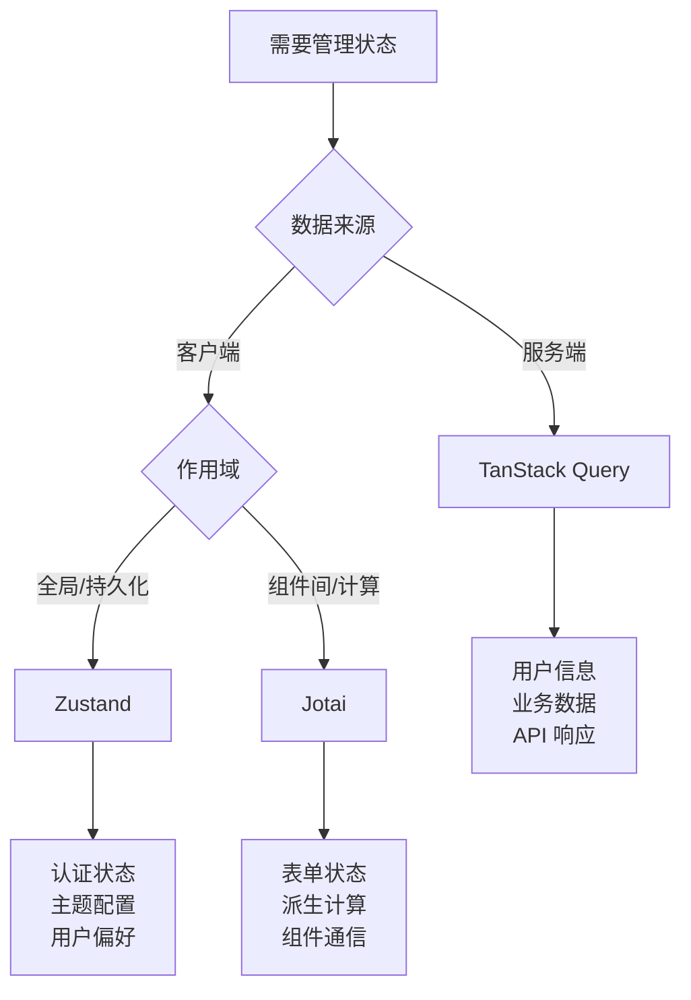

# 状态管理架构指南

## 1. 概述

本项目采用多层状态管理架构，结合三种工具的优势：

- **Zustand**: 客户端状态管理
- **TanStack Query**: 服务端状态管理  
- **Jotai**: 原子化状态管理

### 架构原则

```
┌─────────────────┬─────────────────┬─────────────────┐
│   客户端状态     │   服务端状态     │   原子化状态     │
│   (Zustand)     │ (TanStack Query)│   (Jotai)       │
├─────────────────┼─────────────────┼─────────────────┤
│ • 认证状态       │ • 用户信息       │ • 组件间共享     │
│ • UI 状态        │ • 业务数据       │ • 计算派生       │
│ • 应用配置       │ • 实时数据       │ • 复杂表单       │
│ • 用户偏好       │ • 缓存管理       │ • 异步组合       │
└─────────────────┴─────────────────┴─────────────────┘
```

### 选择决策树



## 2. Zustand - 客户端状态管理

### 2.1 适用场景

#### ✅ 推荐使用
- **认证状态**: token、用户ID、登录状态
- **UI 状态**: 主题、语言、侧边栏状态
- **应用配置**: 用户偏好、设置项
- **持久化数据**: 需要跨会话保存的状态

#### ❌ 不推荐使用
- 服务端数据（用 TanStack Query）
- 频繁变化的计算状态（用 Jotai）
- 组件内部状态（用 useState）

### 2.2 Store 设计模式

#### 认证 Store
```typescript
// lib/store/stores/auth.ts
export type AuthState = {
  accessToken: string | null
  userId: string | null
  isAuthenticated: boolean
}

export type AuthActions = {
  setAuth: (token: string, userId: string) => void
  clearAuth: () => void
}

export const createAuthStore = () => {
  return createStore<AuthStore>()(
    persist(
      (set) => ({
        accessToken: null,
        userId: null,
        isAuthenticated: false,
        setAuth: (accessToken, userId) => set({ 
          accessToken, 
          userId, 
          isAuthenticated: true 
        }),
        clearAuth: () => set({ 
          accessToken: null, 
          userId: null, 
          isAuthenticated: false 
        }),
      }),
      {
        name: 'auth-storage',
        storage: createJSONStorage(() => localStorage),
      }
    )
  )
}
```

#### UI Store
```typescript
// lib/store/stores/ui.ts
export type UIState = {
  theme: 'light' | 'dark' | 'system'
  sidebarOpen: boolean
  language: string
}

export const createUIStore = () => {
  return createStore<UIStore>()(
    persist(
      (set) => ({
        theme: 'system',
        sidebarOpen: true,
        language: 'zh-CN',
        setTheme: (theme) => set({ theme }),
        toggleSidebar: () => set((state) => ({ 
          sidebarOpen: !state.sidebarOpen 
        })),
        setLanguage: (language) => set({ language }),
      }),
      { name: 'ui-storage' }
    )
  )
}
```

### 2.3 Provider 模式

```typescript
// lib/store/providers/auth.tsx
export const AuthStoreProvider = ({ children }: PropsWithChildren) => {
  const storeRef = useRef<AuthStoreApi | null>(null)
  if (!storeRef.current) {
    storeRef.current = createAuthStore()
  }

  return (
    <AuthStoreContext.Provider value={storeRef.current}>
      {children}
    </AuthStoreContext.Provider>
  )
}

export const useAuthStore = <T,>(selector: (store: AuthStore) => T): T => {
  const context = useContext(AuthStoreContext)
  if (!context) throw new Error('useAuthStore must be used within AuthStoreProvider')
  return useStore(context, selector)
}
```

## 3. TanStack Query - 服务端状态管理

### 3.1 适用场景

#### ✅ 推荐使用
- **用户数据**: 个人信息、权限、角色
- **业务数据**: 文章、评论、订单、产品
- **列表数据**: 分页、搜索、筛选结果
- **实时数据**: 通知、消息、状态更新
- **关联数据**: 需要缓存和同步的服务端数据

#### ❌ 不推荐使用
- 纯客户端状态（用 Zustand/Jotai）
- 一次性请求（直接用 fetch）
- 文件上传进度（用 useState）

### 3.2 查询封装模式

#### 用户查询
```typescript
// lib/auth/queries.ts
export const useUserQuery = (userId: string | null) => {
  return useQuery({
    queryKey: ['user', userId],
    queryFn: () => fetchUser(userId!),
    enabled: !!userId,
    staleTime: 5 * 60 * 1000, // 5分钟缓存
    select: (data): User => ({
      id: data.id,
      name: data.name,
      email: data.email,
      roles: data.roles || [],
      permissions: data.permissions || [],
    }),
  })
}

export const useUpdateUserMutation = () => {
  const queryClient = useQueryClient()
  
  return useMutation({
    mutationFn: updateUser,
    onSuccess: (data) => {
      // 更新缓存
      queryClient.setQueryData(['user', data.id], data)
      // 失效相关查询
      queryClient.invalidateQueries({ queryKey: ['users'] })
    },
  })
}
```

#### 列表查询
```typescript
// lib/api/posts.ts
export const usePostsQuery = (params: PostsParams) => {
  return useQuery({
    queryKey: ['posts', params],
    queryFn: () => fetchPosts(params),
    keepPreviousData: true, // 分页时保持上一页数据
    staleTime: 2 * 60 * 1000, // 2分钟缓存
  })
}

export const useInfinitePostsQuery = (params: PostsParams) => {
  return useInfiniteQuery({
    queryKey: ['posts', 'infinite', params],
    queryFn: ({ pageParam = 1 }) => fetchPosts({ ...params, page: pageParam }),
    getNextPageParam: (lastPage) => lastPage.nextPage,
  })
}
```

### 3.3 缓存策略

```typescript
// lib/query-client.ts
export const queryClient = new QueryClient({
  defaultOptions: {
    queries: {
      staleTime: 1 * 60 * 1000, // 1分钟
      cacheTime: 5 * 60 * 1000, // 5分钟
      retry: (failureCount, error) => {
        if (error.status === 404) return false
        return failureCount < 3
      },
    },
    mutations: {
      retry: 1,
    },
  },
})
```

## 4. Jotai - 原子化状态管理

### 4.1 适用场景

#### ✅ 推荐使用
- **组件间通信**: 跨组件的细粒度状态
- **计算派生**: 基于其他状态的计算值
- **复杂表单**: 多步骤、动态表单状态
- **异步组合**: 多个异步状态的组合
- **临时状态**: 不需要持久化的共享状态

#### ❌ 不推荐使用
- 全局应用状态（用 Zustand）
- 服务端数据（用 TanStack Query）
- 简单组件状态（用 useState）

### 4.2 原子定义模式

#### 基础原子
```typescript
// lib/atoms/counter.ts
export const countAtom = atom(0)
export const doubleCountAtom = atom((get) => get(countAtom) * 2)

// 可写派生原子
export const incrementAtom = atom(
  null,
  (get, set) => set(countAtom, get(countAtom) + 1)
)
```

#### 异步原子
```typescript
// lib/atoms/weather.ts
export const cityAtom = atom('Beijing')
export const weatherAtom = atom(async (get) => {
  const city = get(cityAtom)
  const response = await fetch(`/api/weather/${city}`)
  return response.json()
})
```

#### 原子家族
```typescript
// lib/atoms/todos.ts
export const todoAtomFamily = atomFamily((id: string) =>
  atom({
    id,
    text: '',
    completed: false,
  })
)

export const todoIdsAtom = atom<string[]>([])
export const todosAtom = atom((get) => {
  const ids = get(todoIdsAtom)
  return ids.map(id => get(todoAtomFamily(id)))
})
```

### 4.3 表单状态管理

```typescript
// lib/atoms/form.ts
export const formAtom = atom({
  name: '',
  email: '',
  age: 0,
})

export const formErrorsAtom = atom((get) => {
  const form = get(formAtom)
  const errors: Record<string, string> = {}
  
  if (!form.name) errors.name = '姓名不能为空'
  if (!form.email.includes('@')) errors.email = '邮箱格式错误'
  if (form.age < 0) errors.age = '年龄不能为负数'
  
  return errors
})

export const isFormValidAtom = atom((get) => {
  const errors = get(formErrorsAtom)
  return Object.keys(errors).length === 0
})
```

## 5. 集成使用模式

### 5.1 认证流程集成

```typescript
// hooks/useAuth.ts
export const useAuth = () => {
  // Zustand: 认证状态
  const { isAuthenticated, userId, setAuth, clearAuth } = useAuthStore()
  
  // TanStack Query: 用户详细信息
  const { data: user, isLoading } = useUserQuery(userId)
  
  // Jotai: 权限计算
  const [permissions] = useAtom(userPermissionsAtom)
  
  return {
    isAuthenticated,
    user,
    permissions,
    isLoading,
    login: setAuth,
    logout: clearAuth,
  }
}
```

### 5.2 数据流示例

```typescript
// 1. 用户登录 (Zustand)
const login = async (credentials) => {
  const { token, userId } = await loginAPI(credentials)
  setAuth(token, userId) // 更新认证状态
}

// 2. 获取用户信息 (TanStack Query)
const { data: user } = useUserQuery(userId) // 自动触发查询

// 3. 计算权限 (Jotai)
const userPermissionsAtom = atom((get) => {
  const user = get(userDataAtom)
  return calculatePermissions(user?.roles || [])
})
```

## 6. 最佳实践

### 6.1 状态分类指南

| 状态类型 | 工具选择 | 理由 |
|---------|---------|------|
| 认证 token | Zustand | 需要持久化，全局访问 |
| 用户信息 | TanStack Query | 服务端数据，需要缓存同步 |
| 主题设置 | Zustand | 用户偏好，需要持久化 |
| 表单验证 | Jotai | 计算派生，组件间共享 |
| API 数据 | TanStack Query | 服务端状态，自动管理 |
| 临时 UI 状态 | useState | 组件内部，简单状态 |

### 6.2 性能优化

#### Zustand 优化
```typescript
// 使用选择器避免不必要的重渲染
const theme = useUIStore((state) => state.theme) // ✅ 只订阅 theme
const { theme } = useUIStore() // ❌ 订阅整个 store
```

#### TanStack Query 优化
```typescript
// 合理设置缓存时间
const { data } = useQuery({
  queryKey: ['posts'],
  queryFn: fetchPosts,
  staleTime: 5 * 60 * 1000, // 5分钟内不重新请求
  cacheTime: 10 * 60 * 1000, // 10分钟后清除缓存
})
```

#### Jotai 优化
```typescript
// 使用 selectAtom 避免不必要的计算
const nameAtom = selectAtom(userAtom, (user) => user.name)
```

### 6.3 错误处理

```typescript
// TanStack Query 错误处理
const { data, error, isError } = useQuery({
  queryKey: ['user'],
  queryFn: fetchUser,
  retry: (failureCount, error) => {
    if (error.status === 401) {
      clearAuth() // 清除认证状态
      return false
    }
    return failureCount < 3
  },
})

// Jotai 异步错误处理
const weatherAtom = atom(async (get) => {
  try {
    const city = get(cityAtom)
    return await fetchWeather(city)
  } catch (error) {
    throw new Error(`获取天气失败: ${error.message}`)
  }
})
```

## 7. 调试工具

### 7.1 开发工具配置

```typescript
// 开发环境启用 DevTools
if (process.env.NODE_ENV === 'development') {
  // Zustand DevTools
  import('zustand/middleware').then(({ devtools }) => {
    // 在 store 中启用 devtools
  })
  
  // TanStack Query DevTools
  import('@tanstack/react-query-devtools').then(({ ReactQueryDevtools }) => {
    // 在应用中添加 DevTools 组件
  })
  
  // Jotai DevTools
  import('jotai-devtools').then(({ useAtomsDevtools }) => {
    // 在根组件中启用
  })
}
```

### 7.2 状态追踪

```typescript
// 添加日志中间件
const loggerMiddleware = (config) => (set, get, api) =>
  config(
    (...args) => {
      console.log('State change:', args)
      set(...args)
    },
    get,
    api
  )
```

## 8. 迁移策略

### 8.1 渐进式迁移

1. **第一阶段**: 新功能使用新架构
2. **第二阶段**: 重构核心状态（认证、主题）
3. **第三阶段**: 迁移业务数据到 TanStack Query
4. **第四阶段**: 优化和清理旧代码

### 8.2 兼容性处理

```typescript
// 提供兼容层
export const useLegacyUser = () => {
  const { user } = useAuth() // 新架构
  return user || getLegacyUser() // 兼容旧数据
}
```

## 9. 总结

### 决策矩阵

| 需求 | Zustand | TanStack Query | Jotai | 原因 |
|-----|---------|---------------|-------|------|
| 用户认证 | ✅ | ❌ | ❌ | 需要持久化和全局访问 |
| 用户信息 | ❌ | ✅ | ❌ | 服务端数据，需要缓存 |
| 主题配置 | ✅ | ❌ | ❌ | 用户偏好，需要持久化 |
| 表单验证 | ❌ | ❌ | ✅ | 计算派生，组件间共享 |
| API 列表 | ❌ | ✅ | ❌ | 服务端数据，分页缓存 |
| 计数器 | ❌ | ❌ | ✅ | 简单状态，原子化管理 |

### 核心原则

1. **单一职责**: 每种工具专注自己的领域
2. **数据流清晰**: 明确状态的来源和流向
3. **性能优先**: 选择最适合的工具避免过度工程
4. **开发体验**: 保持代码简洁和类型安全
5. **可维护性**: 便于测试、调试和扩展

通过合理使用这三种状态管理工具，可以构建出高性能、可维护的现代 React 应用。